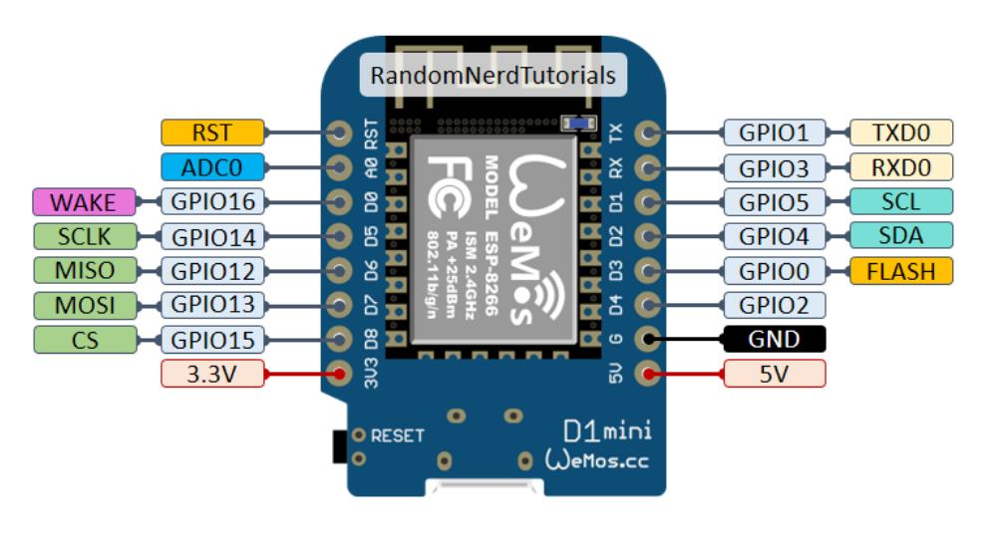
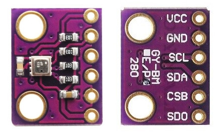
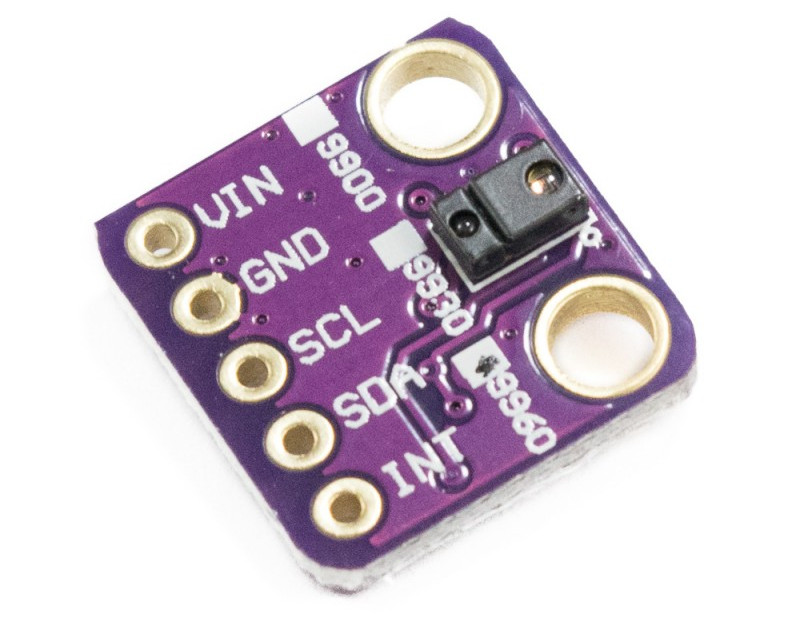
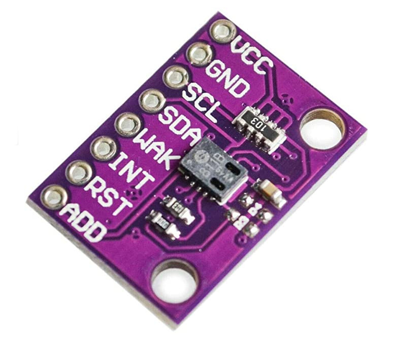
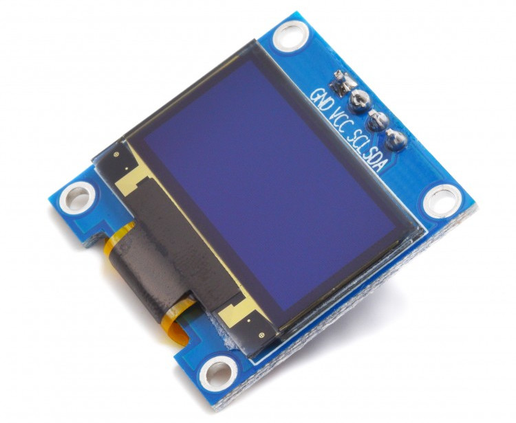
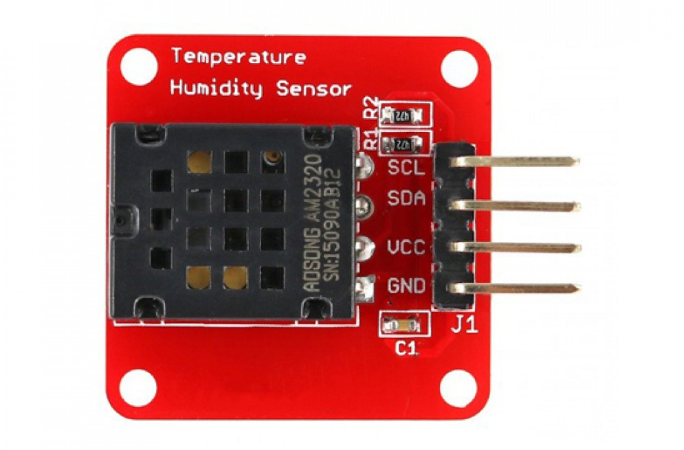
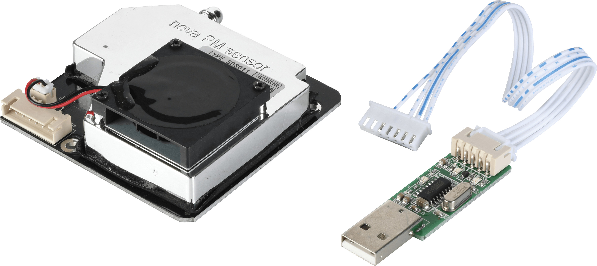

# tauno-env-monitor

Home environment monitoring system. Sensors will measure particulate matter (Ultrafine dust PM2.5 and fine dust PM10), co2, TVOC, ambient light, humidity, temperature and barometric pressure.

- First test all sensors separately to make sure they all work properly.
- There are different libraries. Test them to be sure they will work with your MCU and sensor.
- Keep code modular. So you can easily add and remove sections.

### Links:

- https://thingspeak.com/
- https://github.com/mathworks/thingspeak-arduino

## Main board: WeMos D1 mini (ESP8266)

- 3.3V

Default I2C SDA/SCL pins:

- D2 - GPIO4 - SDA
- D1 - GPIO5 - SCL

### Links:

- https://randomnerdtutorials.com/esp8266-pinout-reference-gpios/

## BMP280 Humidity, temperature, barometric pressure and altitude sensor

- I2C Address: 0x76 or 0x77

### Pins

|  BMP280  |  ESP8266  |
|:--------:|:---------:|
|   VCC    |    3V3    |
|   GND    |    GND    |
|   SCL    |    D1     |
|   SDA    |    D2     |
|   CSE    |    -      |
|   SDD    |    -      |

### Library:

- Adafruit_BMP280_Library
- https://learn.adafruit.com/adafruit-bmp280-barometric-pressure-plus-temperature-sensor-breakout/overview

## APDS-9960 Proximity, RGB and gesture sensor

- I2C Address: 0x39
- ambient light
- color measuring
- proximity detection
- touchless gesture. Operating range 10-20cm.

### Pins

| APDS9960 |  ESP8266  |
|:--------:|:---------:|
|   VIN    |    3V3    |
|   GND    |    GND    |
|   SCL    |    D1     |
|   SDA    |    D2     |
|   INT    |    -      |

### Library:

- It works when you comment out //_wire.end();
- https://github.com/arduino-libraries/Arduino_APDS9960

## CCS-811 (CJMCU-811) Digital gas sensor monitoring indoor air quality

- I2C Address: 0x5A or 0x5B
- Needs pullup resistors
- eCO2
- eTVOCs

### Pins

| CCS811  |  ESP8266  |
|:-------:|:---------:|
|   VCC   |    3V3    |
|   GND   |    GND    |
|   SDA   |    D2     |
|   SCL   |    D1     |
| nWAKE   | D3 or GND |
|   INT   |    -      |
|   RST   |    -      |
|   ADD   |    -      |

### Update sensor firmware:

- https://github.com/maarten-pennings/CCS811/tree/master/examples/ccs811flash

### Library: 

- https://github.com/adafruit/Adafruit_CCS811
- https://github.com/maarten-pennings/CCS811

## 1.3" Oled display module 128x64

- I2C Address: 0x3c (Although marking on display says 0x78).

Unknown manufacturer. After trial and error, I discovered my display driver is SH1106. Not SSD1306 like Adafruit uses.

### Pins

|   OLED  |  ESP8266  |
|:-------:|:---------:|
|   GND   |    GND    |
|   VCC   |    5V     |
|   SCL   |    D1     |
|   SDA   |    D2     |

### Library:

- https://github.com/olikraus/U8g2_Arduino
- https://github.com/olikraus/u8g2/wiki/u8x8reference

------------------------------------

## AM2320 Temperature and humidity sensor

- I2C Address: 0x5C

### Pins

| AM2320  |  ESP8266  |
|:-------:|:---------:|
|   GND   |    GND    |
|   VCC   |    3V3    |
|   SDA   |    D2     |
|   SCL   |    D1     |

### Library:

- https://github.com/adafruit/Adafruit_AM2320

## Nova PM SDS011 Dust sensor

Can measure fine dust and smoke = particulate matter (MP) concentrations in two categories:

- Ultrafine dust particles with a diameter of 0 – 2.5 micrometres (μm/m3). Output PM2.5
- Fine dust particles with a diameter 2.5 – 10 micrometres (μm/m3). Output PM10
- RX UART data (3.3V)
- TX UART data (3.3V)

### Pins

| SDS011  |  ESP8266  |
|:-------:|:---------:|
|   TXD   |     D7    |
|   RXD   |     D8    |
|   GND   |    GND    |
|   25um  |     -     |
|   5V    |     5V    |
|   1um   |     -     |
|   NC    |     -     |

### Library:

- https://github.com/lewapek/sds-dust-sensors-arduino-library

### Python scripts (not tested):

- https://gist.github.com/netmaniac/a6414149a5a09ba1ebf702ff8d5056c5
- https://gitlab.com/frankrich/sds011_particle_sensor